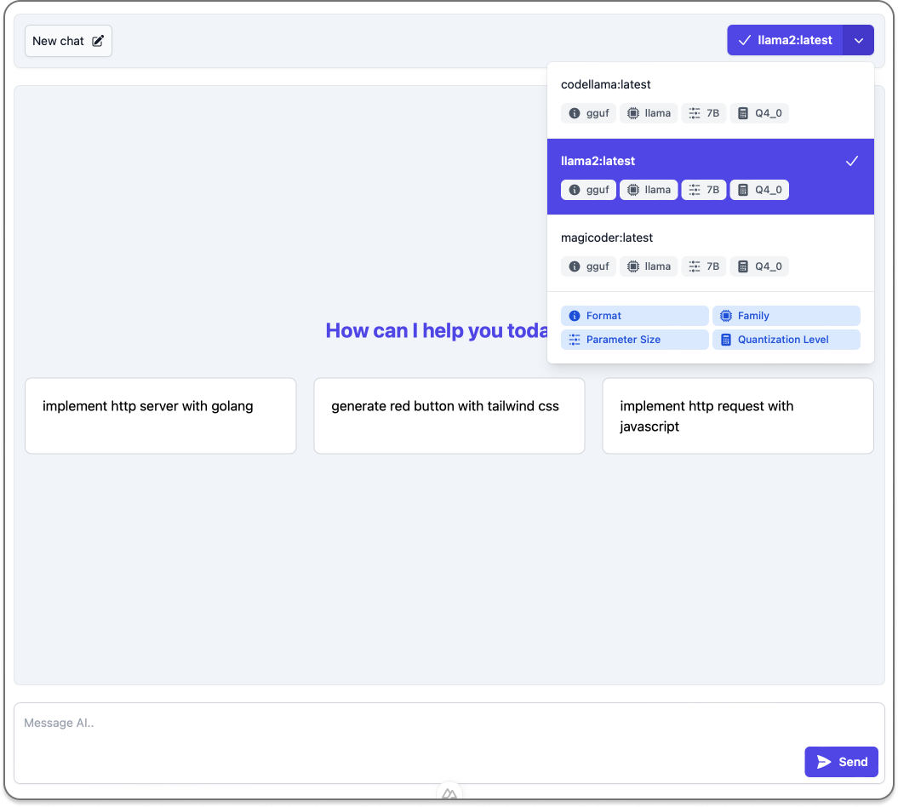
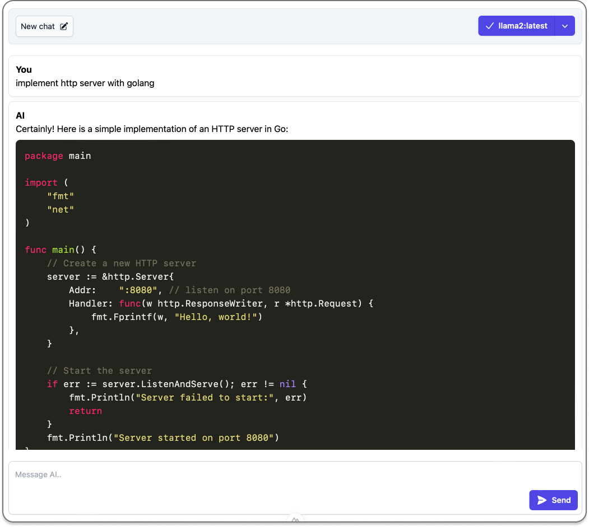

# Nuxt Ollama Chat

## About

Nuxt Ollama Chat is an open source and minimal chat UI for Ollama. UI Uses Ollama stream API.





## Running Localy

### 1. Clone Repo

```bash
git clone https://github.com/apoStyLEE/nuxt-ollama-chat
```

### 2. Install Dependencies

```bash
# npm
npm install

# pnpm
pnpm install

# yarn
yarn install

# bun
bun install
```

### 3. Run Ollama server

Either via the cli:

```bash
ollama serve
```

or via the [desktop client](https://ollama.ai/download)

### 4. Run App (Development Server)

Start the development server on `http://localhost:3000`:

```bash
# npm
npm run dev

# pnpm
pnpm run dev

# yarn
yarn dev

# bun
bun run dev
```

Check out the [deployment documentation](https://nuxt.com/docs/getting-started/deployment) for more information.
